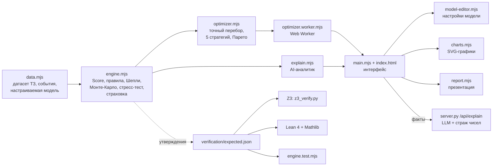

# Аким на 5 часов — AI-симулятор управления городом

Команда **BEZBAB** · HackAlem AI · задача «Аким на 5 часов».

Веб-симулятор, в котором пользователь с **единым бюджетом 100 единиц** принимает **ровно 5 управленческих решений** для 5 районов Астаны (синтетические данные задачи). Система считает **Astana Quality of Life Score** строго по формулам задания, предлагает **5 оптимальных стратегий**, объясняет сильные стороны, риски и последствия каждого сценария и сравнивает его со **всеми 694 395 допустимыми наборами**. Математика модели и оптимизатора **формально проверена в Z3 и Lean 4 + Mathlib**.

**Запуск за 1 минуту:** нужен только Python 3.8+ и браузер. Установка пакетов, аккаунты и API-ключи не нужны.

```bash
git clone https://github.com/BAITC-Hacks/hack-ccf09524-bezbab.git
cd hack-ccf09524-bezbab
python server.py
```

Откройте <http://127.0.0.1:8000>.

## Содержание

1. [Описание решения и назначение](#1-описание-решения-и-назначение)
2. [Системные требования и зависимости](#2-системные-требования-и-зависимости)
3. [Установка](#3-установка)
4. [Запуск](#4-запуск)
5. [Параметры окружения](#5-параметры-окружения)
6. [Проверка основного сценария](#6-проверка-основного-сценария)
7. [Автоматические тесты и формальная проверка](#7-автоматические-тесты-и-формальная-проверка)
8. [Архитектура](#8-архитектура)
9. [Используемые технологии](#9-используемые-технологии)
10. [Модель расчёта (строго по условию)](#10-модель-расчёта-строго-по-условию)
11. [Как устроен AI](#11-как-устроен-ai)
12. [Стратегии, страховка от событий, настройки модели](#12-стратегии-страховка-от-событий-настройки-модели)
13. [Соответствие задаче](#13-соответствие-задаче)
14. [Сторонние компоненты, данные и AI-инструменты](#14-сторонние-компоненты-данные-и-ai-инструменты)
15. [Потенциал развития и ограничения](#15-потенциал-развития-и-ограничения)
16. [Соответствие README требованиям Положения](#16-соответствие-readme-требованиям-положения)

## 1. Описание решения и назначение

**Проблема.** При развитии города нужно одновременно учитывать транспорт, экологию, социальную инфраструктуру, безопасность и городские сервисы, а ресурсов не хватает на всё. Любое распределение бюджета — это компромисс, и его последствия для разных районов неочевидны.

**Пользователь.** Городской управленец, аналитик или участник симулятора.

**Что делает система.**

- Показывает исходное состояние города: 5 районов × 10 показателей, критические значения, исходный Score = 52.56.
- Предлагает **5 стратегий** — наборов из 5 мероприятий с разными приоритетами (максимальный результат, резерв на ЧС, поддержка отстающих, улучшения для всех районов, быстрый эффект), с таблицей сравнения.
- Даёт доработать стратегию или собрать свой набор из 14 мероприятий. Бюджет и правила задачи контролируются автоматически, недопустимые варианты блокируются с объяснением причины.
- Для выбранного сценария: итоговый Score с формулой, **AI-аналитик** (сильные стороны, риски, последствия для жителей, компромиссы), вклад каждого решения, место среди всех допустимых сценариев, устойчивость, стресс-тест городскими событиями и перераспределение бюджета.
- Страховка от городских событий: резерв под выбранные события закладывается заранее, и стратегии пересчитываются.
- Сравнение команд по коду или ссылке и автогенерация презентации решения (5 слайдов, печать в PDF).

**Ценность.** Решение показывает не только «сколько баллов», но и **почему**: какие меры дали прирост, кто из жителей выиграл, где риск и чем оплачен компромисс. Лучшие варианты найдены полным перебором, а не подбором вручную.

## 2. Системные требования и зависимости

| Компонент | Требование | Обязателен | Назначение |
|---|---|---|---|
| ОС | Windows 10/11, macOS, Linux | да | проверено на Windows 10 |
| Python | **3.8 или новее**, только стандартная библиотека | да | локальный веб-сервер `server.py` (проверено на 3.10) |
| Браузер | Chrome / Edge / Яндекс Браузер 100+, Firefox 115+, Safari 16.4+ | да | интерфейс: ES-модули, Web Worker, import maps |
| Интернет | не обязателен | нет | только шрифты Google Fonts; без интернета используется системный шрифт |
| Git | любой | нет | чтобы клонировать репозиторий (можно скачать ZIP) |
| Node.js | 20+ | нет | запуск тестов через `node --test` (проверено на 24) |
| `anthropic` (Python) | актуальная версия, `pip install anthropic` | нет | LLM-объяснение (нужен ключ Anthropic) |
| `z3-solver` (Python) | ≥ 4.12, `pip install -r verification/requirements.txt` | нет | формальная проверка Z3 |
| Lean 4 + Mathlib | elan, Lean v4.33.1, Mathlib v4.33.1 (~5 ГБ) | нет | формальные доказательства |

Сборка, npm-пакеты, база данных и Docker не нужны. Вся основная функциональность работает офлайн, **без личных аккаунтов, подписок и ключей** (п. 5.6.6 Положения).

## 3. Установка

```bash
git clone https://github.com/BAITC-Hacks/hack-ccf09524-bezbab.git
cd hack-ccf09524-bezbab
```

Больше ничего устанавливать не нужно. Вместо `git clone` можно скачать ZIP-архив ветки `main` на GitHub и распаковать его.

Необязательные компоненты:

```bash
# LLM-объяснение (иначе объяснения строит аналитик на правилах)
pip install anthropic

# формальная проверка Z3
pip install -r verification/requirements.txt
```

## 4. Запуск

Из корня репозитория:

| ОС | Команда |
|---|---|
| Windows | `python server.py` или `py server.py` |
| macOS / Linux | `python3 server.py` |

В консоли появится `Откройте http://127.0.0.1:8000`. Откройте этот адрес в браузере. Остановить сервер — `Ctrl+C`.

- Другой порт: `python server.py --port 8010`, тогда адрес будет `http://127.0.0.1:8010`.
- Открывать `index.html` двойным кликом нельзя: браузеры не загружают JavaScript-модули по `file://`. Сервер нужен именно для этого.
- При первом открытии оптимизатор 0,5–1 с перебирает все наборы в фоне. В правом верхнем углу появится «Проверено 694 395 сценариев · максимум 57.24».

**Если что-то пошло не так**

| Симптом | Решение |
|---|---|
| `python` не найден | Windows: `py server.py`; macOS/Linux: `python3 server.py` |
| «Порт 8000 занят» | `python server.py --port 8010` |
| Открылся другой или старый интерфейс | На порту 8000 уже работает другой сервер (Windows позволяет двум процессам слушать один порт). Запустите на другом порту: `--port 8010` |
| Пустая страница | Откройте через `http://127.0.0.1:…`, а не как файл; обновите браузер до версии из раздела 2 |
| Остались изменения модели или страховки с прошлого запуска | ⚙ → «Вернуть модель ТЗ»; снимите галочки страховки; или очистите данные сайта в браузере |

## 5. Параметры окружения

**Для основной функциональности переменные окружения не нужны.**

| Параметр | Тип | По умолчанию | Назначение |
|---|---|---|---|
| `--port` | аргумент `server.py` | `8000` | порт веб-сервера (слушает только `127.0.0.1`) |
| `ANTHROPIC_API_KEY` | переменная окружения | не задана | включает LLM-объяснение (нужен пакет `anthropic`) |
| `ANTHROPIC_AUTH_TOKEN` / `ANTHROPIC_PROFILE` | переменная окружения | не задана | альтернативные способы авторизации SDK Anthropic |
| `AKIM_MODEL` | переменная окружения | `claude-opus-5` | модель Claude для LLM-объяснения |

Включить LLM-объяснение:

```bash
# Windows (PowerShell)
$env:ANTHROPIC_API_KEY = "ваш-ключ"; python server.py
# macOS / Linux
ANTHROPIC_API_KEY="ваш-ключ" python3 server.py
```

Без ключа сервер пишет `LLM-объяснение: выключено … работает объяснение по правилам`, и приложение работает полностью. Ключ хранится только на сервере и не попадает в браузер.

Браузер хранит в `localStorage` таблицу команд, изменённую модель и отметки страховки. Серверной базы данных нет.

## 6. Проверка основного сценария

Пошаговый чек-лист, ~5 минут. Все ожидаемые числа проверены на свежем клоне ветки `main`.

| # | Действие | Ожидаемый результат |
|---|---|---|
| 1 | Запустите `python server.py`, откройте <http://127.0.0.1:8000> | Справа вверху «Проверено 694 395 сценариев · максимум 57.24». Блок «Город до ваших решений»: **исходный Score 52.56**, 5 районов, у Нуры красным «Школы и детсады 38» и «Поликлиники 35» |
| 2 | Прокрутите до «Выберите стратегию» | 5 карточек: **Максимальный результат 57.24**, Надёжный с резервом 57.09, Поддержка отстающих 55.43, Улучшения для всех районов 55.95, Быстрый эффект 56.05. Ниже таблица сравнения со звёздочками ★ |
| 3 | Нажмите «Выбрать» на «Максимальный результат» | Раздел результата: **57.24**, формула `0.7 × 58.58 + 0.3 × 54.09 (Нура) − 0 = 57.24`, «Место среди всех допустимых: 1 из 694 395». Ниже AI-аналитик (объяснение, сильные стороны, риски, последствия для жителей), «Вклад каждого решения» (сумма = +4.68), графики, районы до/после |
| 4 | Кнопка «Собрать свой набор ↗» → в тёмной панели «Пример из ТЗ» → «Рассчитать сценарий» | **Score 56.54**, стоимость 95, место 566 из 694 395. В сильных сторонах: «Сработала синергия «Освещение и камеры…» + «Единая цифровая платформа обращений»» |
| 5 | **Контроль бюджета:** «Изменить состав» → уберите «Единая цифровая платформа обращений» (×) | Расход 81. У «Линия ЛРТ / расширение» кнопки районов заблокированы, подсказка «Не хватает 11 ед. бюджета». При 5 выбранных мерах остальные заблокированы: «Уже выбрано 5 решений — уберите одно» |
| 6 | **Изменение решений меняет Score:** верните платформу обращений, у «Перевод частного сектора на чистое топливо» нажмите «Алматы» вместо «Сарыарка» | Прогноз Score меняется **56.54 → 56.58** |
| 7 | Закройте конструктор. В «Страховке от городских событий» отметьте «Авария на теплотрассе зимой» | Стратегии пересчитываются: «Максимальный результат» **57.23**, «Резерв под страховку: нужно 6 · есть 9» — оптимизатор сам взял «Аварийные бригады ЖКХ», и ликвидация подешевела с 12 до 6 ед. Снимите галочку — снова 57.24 |
| 8 | В результате сценария, блок «Стресс-тест» → «Перераспределить» у непокрытого события | Варианты перестройки набора (1, 2, … изменения) с Score, ценой мер и ликвидации, кнопка «Применить» |
| 9 | Внизу результата: «Сохранить результат», «Сгенерировать презентацию» | Сценарий появляется в таблице команд; открывается 5 слайдов с кнопкой «Печать / PDF» |
| 10 | Откройте <http://127.0.0.1:8000/tests.html> | «**16 из 16 тестов пройдено**» |

Дополнительно: ⚙ в правом верхнем углу — «Настройки модели» (раздел 12).

## 7. Автоматические тесты и формальная проверка

| Проверка | Команда | Ожидаемый результат | Время |
|---|---|---|---|
| Тесты модели в браузере, без Node.js | <http://127.0.0.1:8000/tests.html> | 16 из 16 | ~5 с |
| Те же тесты в Node.js 20+ | `node --test` | `pass 16, fail 0` | ~4 с |
| Тесты сервера и стража чисел LLM (без ключей и сети) | `python -m unittest test_server.py` | `OK` (6 тестов) | < 1 с |
| Z3, быстрая проверка (глобальный оптимум) | `python verification/z3_verify.py --quick` | `Итог: 19/19 проверок пройдено`, код выхода 0 | ~5 мин |
| Z3, полная проверка (+ вся граница Парето) | `python verification/z3_verify.py` | `Итог: 37/37 проверок пройдено` | ~25 мин |
| Lean 4 + Mathlib | см. ниже | компиляция без ошибок и без `sorry` | ~5 мин + загрузка Mathlib |

`engine.test.mjs` — один и тот же файл для Node и браузера: в `tests.html` модули `node:test`, `node:assert/strict`, `node:fs` подменяются браузерными заглушками через import map. Тесты сверяют JS-расчёт с `verification/expected.json` — тем же файлом, который независимо проверяют Z3 и Lean.

**Что проверяет Z3** (`verification/spec.py` — независимая транскрипция условия, `verification/z3_verify.py` — SMT-модель над точными рациональными числами):

- `data.mjs` совпадает с условием задачи (14 мер, 5 районов, веса), суммы весов и долей населения равны 1;
- оценки районов совпадают с таблицей ТЗ, базовый Score ровно 52.55768;
- пример из ТЗ, самый дешёвый набор и оптимум допустимы, их Score совпадает в точном расчёте Python, в SMT-модели и в JS;
- минимальная стоимость допустимого набора — 61 (Z3 minimize);
- **глобальный оптимум 57.236735 доказан**: запрос «существует набор со Score больше» — `unsat`;
- все 11 точек границы «бюджет → максимальный Score» оптимальны (полный режим);
- независимый перебор в Python даёт те же 694 395 допустимых наборов.

**Что доказано в Lean 4 + Mathlib** (`verification/lean/AkimScore.lean`): нормировка весов и долей; базовый Score, Score примера и оптимума — точные равенства в `ℚ`, проверенные ядром Lean (`decide +kernel`, не `native_decide`); пример и оптимум удовлетворяют правилам; оценки районов ∈ [0, 100], Score ≤ 100; **монотонность** — улучшение любых показателей не снижает Score; **эффективность вкладов** — сумма маргинальных вкладов по любому порядку и среднее по всем порядкам (значение Шепли) равны приросту Score.

```bash
# нужен elan (https://github.com/leanprover/elan); первая загрузка Mathlib ~5 ГБ
cd verification/lean
lake exe cache get
lake env lean AkimScore.lean
```

## 8. Архитектура

Клиент-серверное веб-приложение без сборки. Вся модель и оптимизатор работают в браузере. Python-сервер только раздаёт файлы и, если задан ключ, проксирует LLM-объяснение.



**Поток данных.** `data.mjs` → `engine.mjs` считает любой набор решений → `optimizer.mjs` в Web Worker перебирает все допустимые наборы (с учётом страховки) и возвращает распределение, стратегии и границу Парето → `main.mjs` рисует стратегии и результат, `explain.mjs` формирует объяснение из готовых чисел → при наличии ключа `server.py` переписывает объяснение через LLM, и каждое число сверяется с фактами.

| Файл | Назначение |
|---|---|
| `index.html`, `styles.css` | Разметка и стили страницы |
| `main.mjs` | Интерфейс: стратегии, страховка, конструктор, результат, команды, запуск оптимизатора |
| `data.mjs` | Датасет ТЗ (районы, показатели, веса, 14 мер, синергии, несовместимости), городские события, применение и проверка изменённой модели |
| `engine.mjs` | Модель: применение мер, Score, валидатор с причинами, значения Шепли, устойчивость, стресс-тест, стоимость ликвидации и резерв, коды сценариев |
| `optimizer.mjs`, `optimizer.worker.mjs` | Точный перебор, 5 стратегий, граница Парето, ядро лучших решений, лучшая одиночная замена, перераспределение после события |
| `explain.mjs` | AI-аналитик (правила) и пакет фактов для LLM |
| `model-editor.mjs` | Окно «Настройки модели»: мероприятия, веса, синергии, взаимоисключения, события, формула |
| `charts.mjs`, `report.mjs` | SVG-графики и презентация решения |
| `server.py` | Статический сервер без кэша, `GET /api/status`, `POST /api/explain` (LLM + страж чисел) |
| `engine.test.mjs`, `tests.html`, `tests/` | 16 тестов модели, оптимизатора, стратегий, страховки и настроек (Node или браузер) |
| `test_server.py` | Тесты стража чисел и безопасного отключения LLM |
| `verification/` | `expected.json` (утверждения), `spec.py` + `z3_verify.py` (Z3), `lean/` (Lean 4 + Mathlib) |

## 9. Используемые технологии

| Слой | Технологии |
|---|---|
| Интерфейс | HTML5, CSS3, JavaScript (ES-модули), Web Worker, SVG. Без фреймворков, без сборки, без npm |
| Сервер | Python 3, стандартная библиотека (`http.server`, `json`, `argparse`) |
| Расчёт и оптимизация | Собственный детерминированный движок по формулам ТЗ; точный перебор с отсечениями и инкрементальным пересчётом; значения Шепли; Монте-Карло с фиксированным зерном |
| AI | Объяснимый аналитик на правилах; необязательно — Claude через официальный SDK `anthropic` со стражем чисел |
| Проверка | `node:test` / браузерный раннер, Python `unittest`, SMT-решатель Z3, Lean 4 + Mathlib |

## 10. Модель расчёта (строго по условию)

- **Показатель после мер:** `I'_dk = clip(I_dk + Σ эффект × (8 − L)/8 + синергии, 0, 100)`. Горизонт — 8 кварталов, `L` — лаг (срок запуска) меры. Районная мера действует в выбранном районе, городская — во всех пяти.
- **Синергии** («Выделенные полосы» + «Умные светофоры», «Освещение и камеры» + «Платформа обращений», «Чистое топливо» + «Городское озеленение») дают фиксированный бонус в районе первой меры пары, лагом он не масштабируется.
- **Несовместимости:** автобусные полосы и ЛРТ — везде; парк и школа, чистое топливо и модернизация сетей — в одном районе.
- **Оценка района** `D_d = Σ w_k × I'_dk` с весами ТЗ (сумма 1).
- **Score** `= 0.7 × Σ pop_d × D_d + 0.3 × min D_d − N_crit`, где `N_crit` — число пар «район × показатель» строго ниже 40.
- **Правила:** бюджет 100, ровно 5 решений, без повторов, район только у районных мер, не больше 2 мер из одного направления, несовместимости запрещены. Недопустимый набор не считается, валидатор называет причину.
- **Контрольные значения** совпадают с условием: база **52.55768**; пример из ТЗ **56.54307** (стоимость 95, синергия «Освещение и камеры» + «Платформа обращений»); самый дешёвый набор — **61** ед.

Все эффекты мер кратны 1/8, поэтому расчёт в `double` точен: сложение и вычитание эффектов при переборе не накапливают погрешность.

**Что показывают данные:** разброс Score среди допустимых наборов — 52.04–57.24, то есть неудачный выбор может даже ухудшить город. Максимум — 57.24 за 98 ед. Вариант «с резервом» — 57.09 за 86 ед.: он уступает всего 0.15 п., но закрывает все 4 городских события. «Центр семейного здоровья» в Нуре входит в 100% из 2000 лучших наборов.

## 11. Как устроен AI

Решение построено как **нейро-символическая система: числа считает проверяемая модель, объясняет — аналитик и (по желанию) LLM**.

1. **Детерминированная модель** (`engine.mjs`) считает Score по формулам ТЗ, проверяет правила и выдаёт причины отказа.
2. **Оптимизатор** (`optimizer.mjs`, в Web Worker) точно перебирает пространство: C(14,5) наборов мер × до 5⁵ размещений ≈ 1,4 млн вариантов, из них **694 395 допустимых**, за ~0,5 с. Отсечения по бюджету, лимиту направления и несовместимостям; эффект меры прибавляется при входе в ветку и вычитается при выходе. Результат — 5 стратегий с разными целями (отличаются минимум двумя решениями), распределение Score, граница Парето, «ядро» лучших решений.
3. **Вклад решений — значения Шепли:** вклад каждой меры усредняется по всем порядкам добавления, поэтому сумма вкладов в точности равна приросту Score, включая синергии и штрафы.
4. **Неопределённость — Монте-Карло:** 400 прогонов с эффектами ±20% и вероятностью 25% задержки запуска на квартал; фиксированное зерно даёт всем командам одинаковый результат.
5. **Аналитик** (`explain.mjs`) формирует сильные стороны, риски, последствия для жителей и компромиссы только из чисел модели: снятые и оставшиеся критические значения, показатели «на грани», смена слабейшего района, меры с малым вкладом, долгий запуск, побочные эффекты, непокрытые события.
6. **LLM-объяснитель** (необязательный, `server.py`): Claude получает JSON с готовыми фактами и пишет связный текст. **Страж чисел** проверяет каждое число ответа по фактам; при расхождении показывается объяснение аналитика.

## 12. Стратегии, страховка от событий, настройки модели

**5 стратегий.** Максимальный результат; Надёжный с резервом (резерв на ликвидацию любого события); Поддержка отстающих (максимум оценки слабейшего района); Улучшения для всех районов (максимум наименьшего прироста); Быстрый эффект (только меры с запуском за 1–2 квартала). У каждой карточки кнопки «Выбрать» и «Изменить состав», под карточками таблица сравнения.

**Городские события** (синтетическое расширение, на официальный Score не влияют): авария на теплотрассе, смог, всплеск набора в школы, серия ДТП. У события есть район, удар по показателям, стоимость ликвидации и профильные меры. Если профильная мера есть в районе события или действует на весь город, ликвидация дешевле (по умолчанию на 50%), а удар слабее.

- **Страховка (до решения):** отмеченные события закладываются в резерв, режим «одно событие за 2 года» или «все отмеченные сразу». Резерв считается для каждого набора с учётом профильных мер, и стратегии подбираются заново с условием «стоимость мер + резерв ≤ 100».
- **Стресс-тест (после решения):** для выбранного набора видно, какие события покрыты резервом и сколько баллов теряется при остальных. «Перераспределить» ищет наборы, на которые хватит денег вместе с ликвидацией, и показывает цену перестройки.

**Настройки модели** — неприметная кнопка ⚙ в правом верхнем углу:

- вкладки «Мероприятия» (правка и добавление мер), «Веса показателей», «Синергии», «Взаимоисключения», «События» (правка и добавление событий);
- свёрнутый блок «Для опытных: формула итоговой оценки»: веса «средняя / слабейший район», порог и штраф критических значений и **штраф за отставание районов** `− λ × Σ max(0, T − D_d)` (при λ = 0 — формула ТЗ);
- правки применяются после проверки; ошибки блокируют применение, предупреждения — нет;
- пока математика отличается от ТЗ, вверху висит плашка с кнопкой «Вернуть модель ТЗ», а упоминания Z3/Lean скрыты. Для защиты используется модель ТЗ.

## 13. Соответствие задаче

| Требование задачи | Где реализовано |
|---|---|
| Единый бюджет и исходные данные для всех | `data.mjs`: 100 ед., датасет ТЗ; сверка с условием — `verification/z3_verify.py` |
| 5 решений по заданным направлениям | 5 стратегий по 5 мер (`optimizer.mjs → STRATEGY_DEFS`) и конструктор из 14 мер; правила ТЗ в `engine.mjs → validate` |
| Автоматический контроль бюджета | Недопустимые кнопки заблокированы с причиной; `validate()` отклоняет набор; тесты и Z3 |
| AI-анализ решений | Аналитик (`explain.mjs`), оптимизатор, значения Шепли, Монте-Карло, стресс-тест; LLM со стражем чисел |
| Расчёт Astana Quality of Life Score | `engine.mjs → scoreCells`, строго по формуле ТЗ; значения доказаны в Lean |
| Сильные стороны, риски и последствия | Блок «AI-аналитик» и «Главные компромиссы» |
| *Опц.:* сравнение команд | Таблица сценариев, импорт по коду или ссылке `#s=…`, попарное сравнение |
| *Опц.:* визуализация изменений районов | Карточки «до → после», гистограмма всех сценариев, граница Парето |
| *Опц.:* AI-рекомендации | 5 стратегий с таблицей сравнения, лучшая одиночная замена, ядро лучших решений |
| *Опц.:* неожиданные события и перераспределение | Страховка с пересчётом стратегий, стресс-тест, перераспределение, редактор событий |
| *Опц.:* автогенерация презентации | `report.mjs`: 5 слайдов, печать в PDF |
| Критерий: изменение решений меняет Score | Шаг 6 чек-листа; тест `changing a decision changes the Score` |

## 14. Сторонние компоненты, данные и AI-инструменты

Раскрытие по п. 5.4.4 Положения. Весь код приложения создан командой в этом репозитории с помощью AI-ассистентов (см. ниже). Сторонние JS-библиотеки и CDN-скрипты не используются.

| Компонент | Где используется | Лицензия / источник | Обязателен |
|---|---|---|---|
| Стандартная библиотека Python 3 | `server.py` | PSF License | да |
| Шрифты Manrope и DM Sans (Google Fonts) | `styles.css` (`@import`) | SIL Open Font License 1.1 | нет — без интернета системный шрифт |
| Синтетический датасет (районы, показатели, 14 мер, синергии, несовместимости, формула) | `data.mjs`, `verification/spec.py` | условие задачи «Аким на 5 часов» (организатор) | да |
| Городские события и их параметры | `data.mjs → EVENTS` | придуманы командой, синтетические | нет |
| `anthropic` — Python SDK Anthropic | `server.py` (LLM-объяснение) | MIT | нет |
| Модель Claude (Anthropic API) | `/api/explain` | коммерческий API, ключ пользователя | нет |
| `z3-solver` — SMT-решатель Z3 (Microsoft Research) | `verification/z3_verify.py` | MIT | нет |
| Lean 4 и Mathlib | `verification/lean/` | Apache 2.0 | нет |
| Node.js (`node:test`) | запуск тестов | MIT | нет |

**AI-инструменты разработки** (разрешены п. 5.4.12): при разработке команда использовала AI-ассистентов — OpenAI Codex и Claude Code (Anthropic) — для генерации и анализа кода, тестирования и документации. История разработки — в этом репозитории.

## 15. Потенциал развития и ограничения

**Развитие и масштабирование**

- **Реальные данные.** Модель задаётся данными (`data.mjs` и «Настройки модели»): её можно наполнить открытыми данными Астаны или другого города, откалибровать эффекты мер по фактическим проектам.
- **Другие города и отрасли.** Тот же подход «ограниченный бюджет → стратегии → объяснимый результат» подходит для здравоохранения, образования и инфраструктурных программ.
- **Большие каталоги мер.** Точный перебор работает до ~15 млн вариантов. Для больших каталогов та же SMT-кодировка из `z3_verify.py` служит точным оптимизатором без полного перебора.
- **Командный режим.** Серверная таблица результатов для хакатонов, обучения госслужащих и стратегических сессий.
- **Агентный LLM-слой.** Вопросы на естественном языке («что будет, если перенести школу в Есиль?») с вызовом того же проверяемого движка и стражем чисел.

**Ограничения**

- Данные и эффекты синтетические. Для реальных решений нужны открытые данные, калибровка и экспертная проверка причинно-следственных связей.
- Сценарии команд хранятся в браузере (`localStorage`) и передаются кодом или ссылкой. Общего серверного рейтинга пока нет.
- LLM-объяснение требует ключа Anthropic; без него работает аналитик на правилах.
- Формальная проверка относится к модели ТЗ; изменённые в настройках модели проверяются тестами и полным перебором, но не Z3/Lean.

## 16. Соответствие README требованиям Положения

| Требование (п. 5.4.15, 5.6.4, 5.6.6, 5.4.4) | Раздел |
|---|---|
| Описание решения и его назначения | [1](#1-описание-решения-и-назначение) |
| Описание архитектуры | [8](#8-архитектура) |
| Используемые технологии | [9](#9-используемые-технологии) |
| Инструкции по установке | [3](#3-установка) |
| Инструкции по запуску | [4](#4-запуск) |
| Необходимые зависимости и системные требования | [2](#2-системные-требования-и-зависимости) |
| Параметры окружения | [5](#5-параметры-окружения) |
| Порядок проверки основного сценария | [6](#6-проверка-основного-сценария), [7](#7-автоматические-тесты-и-формальная-проверка) |
| Проверка без личных аккаунтов и ключей | [2](#2-системные-требования-и-зависимости), [5](#5-параметры-окружения) |
| Раскрытие сторонних компонентов | [14](#14-сторонние-компоненты-данные-и-ai-инструменты) |
